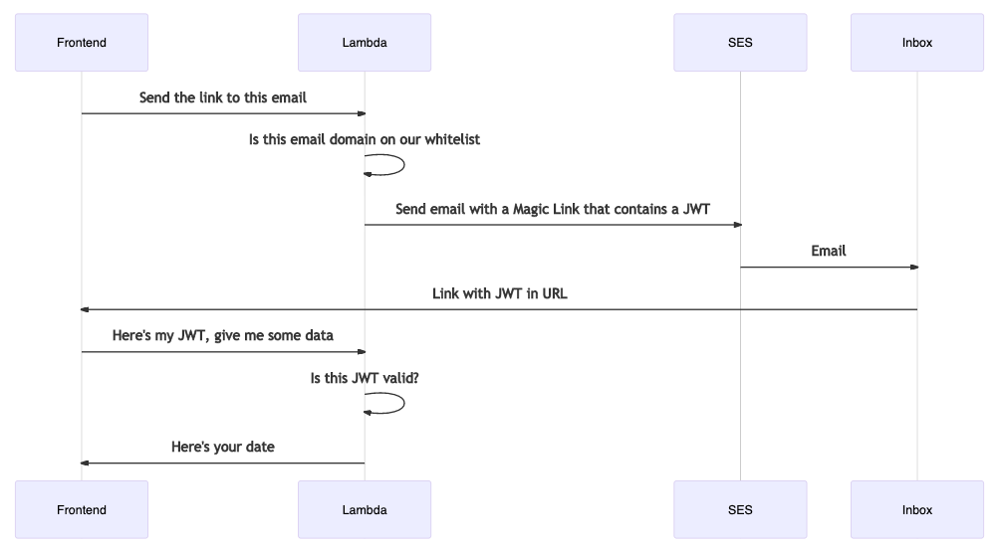

# Internal Magic Links with AWS CDK

This is a fullstack app deployed with AWS CDK that uses magic links for passwordless authentication.

If your email matches the domain whitelist you will receive a link with a JWT that is used to authentication.

That means you can whitelist your business domain and new employees can use this service without any provisioning. They will also lose access to this service if they lose access to their email, after their JWT expires which is currently configured for 1 day.

It's an easy way to get SSO without even needing a database, thanks to the JWT.

It's heavily based on my [Backend Frontend AWS CDK Example](https://github.com/cadbox1/backend-frontend-aws-cdk) which includes more getting started documentation.

## How it works

[Mermaid Sequence Diagram](shorturl.at/bilFI)

1. You type in your email address.
1. If your email is on the domain whitelist you will receive a magic link which includes the JWT.
1. Clicking the magic link loads the JWT into your localstorage on the frontend
1. That JWT is used to authenticate with the lambda

## Development

 * `yarn build`         build the frontend so it's ready to deploy
 * `yarn test`          perform the jest unit tests
 * `yarn deploy`        build the frontend and deploy the cdk stack
 * `yarn cdk bootstrap` prepare the AWS region for cdk deployments

